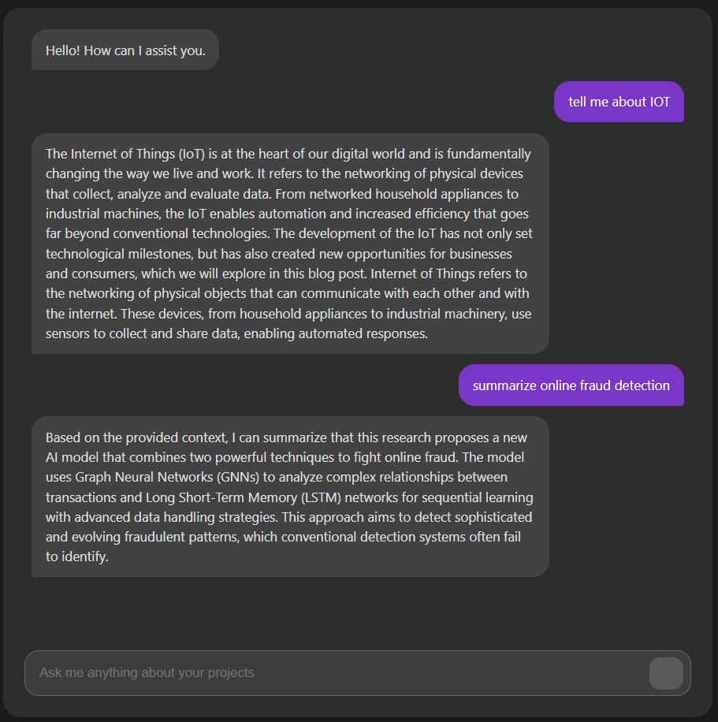
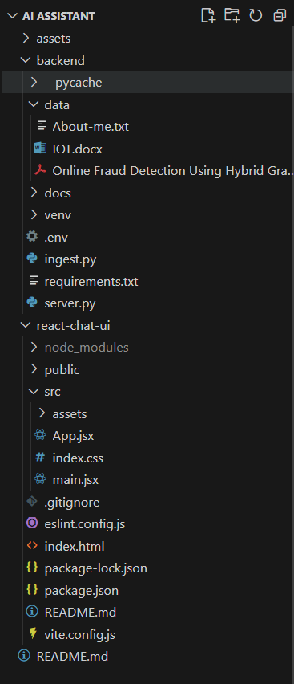

# Jarvis: Your Personal AI Assistant


[](https) 
A personal AI assistant designed to understand and execute complex tasks through a natural language interface. This project integrates cutting-edge AI models with local services to provide a seamless, conversational user experience.

## Contents

* [Key Features](#key-features)
* [Tech Stack](#tech-stack)
* [Architecture](#architecture)
* [Getting Started](#getting-started)
    * [Prerequisites](#prerequisites)
    * [Installation](#installation)
    * [Configuration](#configuration)
* [Usage](#usage)
* [Output](#output)

## Key Features

* **Conversational AI:** Powered by  Ollama for natural, context-aware dialogue.
* **Voice Interface:** Real-time text-to-speech for hassle-free of reading.
* **Vector Search:** Utilizes Pinecone to store and retrieve long-term memories or documents.
* **Task Execution:** Can run local scripts and fetch stored information.
* **Web Dashboard:** A React-based interface for visualizing conversations, and managing settings.

## Tech Stack

This project is built with a modern, decoupled architecture.

* **Frontend:** React, Vite, TypeScript, Tailwind CSS
* **Backend:** Python (FastAPI), Node.js (Express)
* **AI / LLM:** Ollama (Llama 3)
* **Vector Database:** Pinecone
* **Audio Processing:** Web Speech API

## Architecture

* **Frontend (UI):** Captures user input (text/voice) and displays responses.
* **Backend (API):** Handles business logic, processes requests, and orchestrates AI services.
* **AI Core:** Transcribes input, generates LLM responses, and converts text back to speech.
* **Memory (Vector DB):** Provides long-term context to the LLM.


---

## Getting Started

Follow these instructions to get a copy of the project up and running on your local machine.

### Prerequisites

* Python 3.10+
* Node.js 18.0+
* Local LLM Ollama (Llama 3)
* Git

### Installation

1.  **Clone the repository:**
    ```sh
    git clone https://github.com/Parzi02/Personal-AI-Assistant--Jarvis.git
    cd Personal-AI-Assistant--Jarvis
    ```

2.  **Setup Backend (Python):**
    ```sh
    cd backend
    
    # Create a virtual environment
    python -m venv venv
    
    # Activate the environment
    # On Windows:
    .\venv\Scripts\activate
    # On-Mac/Linux:
    source venv/bin/activate
    
    # Install Python dependencies
    pip install -r requirements.txt
    ```

3.  **Setup Frontend (React):**
    ```sh
    cd ../frontend
    
    # Install Node.js dependencies
    npm install
    ```

### Configuration

You must set up your environment variables before running the application.

1.  Navigate to the `backend` directory.
2.  Create a `.env` file by copying the example:
    
3.  Open the `.env` file and fill in the required values:
    ```.env
    # Example .env file
    
    
    # Vector DB Configuration
    PINECONE_API_KEY="your_pinecone_api_key"
    PINECONE_ENVIRONMENT="your_pinecone_env"
    PINECONE_INDEX_NAME="jarvis-memory"
    
    # (Add other keys as needed)
    ```

---

## Usage

You will need to run the backend and frontend in separate terminal windows.

1.  **Run the Backend (API):**
    * Open a terminal, navigate to the `backend` directory, and activate your virtual environment.
    ```sh
    cd backend
    .\venv\Scripts\activate
    
    # Start the FastAPI server
     uvicorn server:app --reload --port 5000
    ```
    The API will be running at `http://localhost:5000`.

2.  **Run the Frontend (UI):**
    * Open a *second* terminal and navigate to the `frontend` directory.
    ```sh
    cd frontend
    
    # Start the React development server
    npm run dev
    ```
    The application will be accessible at `http://localhost:5173`.

## Output
Demo


File Structure



AI-personal-assistant demo

https://github.com/user-attachments/assets/7b3754c1-bc0c-49dc-b334-3e0d14fc9968


---

Sohan Kumar Mondal &copy; 2025
